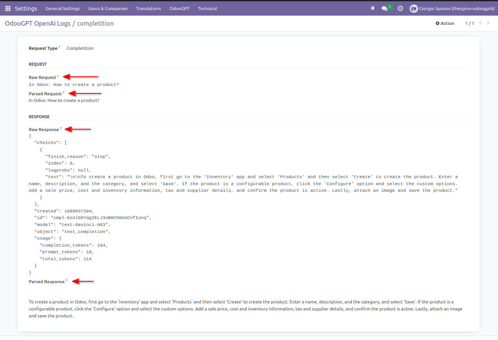

# Api logs

OdooGPT uses a logging table to log ALL requests done to the OpenAI Completition Api. 

It can be found under `Settings → OdooGPT (menu) → OpenAI Logs`. 

By opening a record, you can find raw request and response from OpenAI. That's useful for diagnostic 
purposes. 

