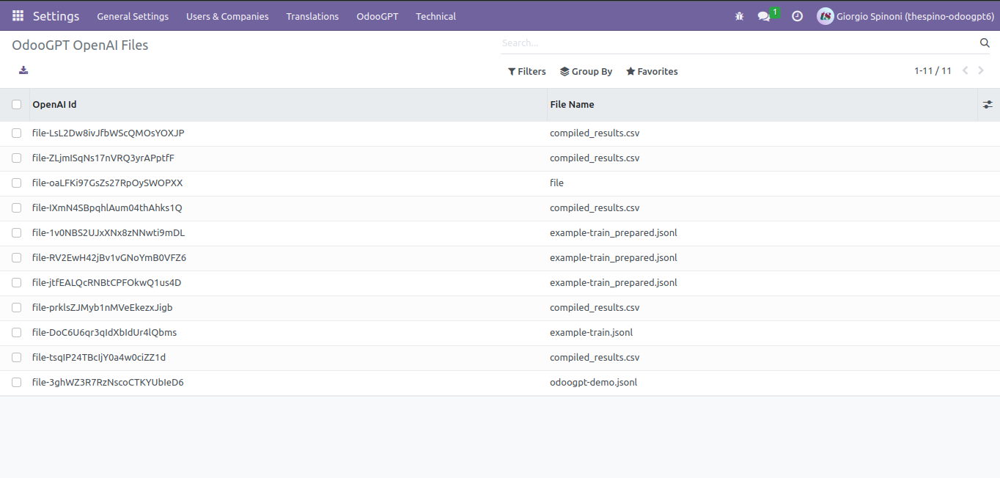
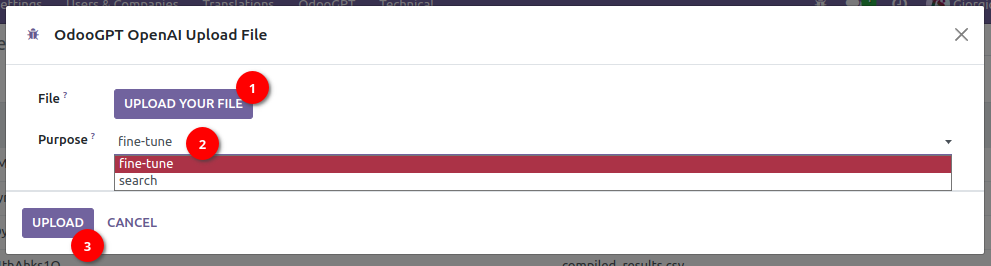

# OpenAI Files

OdooGPT alows to retrieve, show and upload Files from OpenAI api. 

Navigate to `Settings → OdooGPT (menu) → OpenAI Files` to open the list of all files uploaded. 

To refresh the list with OpenAI api, you need to manually click 
`Settings → OdooGPT (menu) → Refresh OpenAI Files`. 

!!! question "FAQ"
    > *The list is empty. What can I do?*

    Simply *Refresh Files* as described above, then refresh the list by pressing **ENTER** on the 
    keyboard into the search field, to refresh the list. 

    That's needed because OdooGPT doesn't need to periodically ask OpenAI for new records and keep 
    them automatically aligned.

## Upload a File

Go to `Settings → OdooGPT (menu) → Upload OpenAI File`. It will show a popup wizard: 

- Select the **file** from your device (jsonl format)
- Select the **purpose** of the file 
- Click "**UPLOAD**"
- The Files list is now updated with the new file

See [OpenAI docs](https://platform.openai.com/docs/api-reference/files) for more info. 

## Delete a File

Go to `Settings → OdooGPT (menu) → OpenAI Files`. It will show the list. 

- Open a record
- Click "**DELETE FROM OPENAI**" button
- The file is deleted both from Odoo and OpenAI

!!! danger "Danger zone"
    The standard Odoo "Delete" action will ONLY DELETE THE FILE FROM ODOO DATABASE. When you then 
    refresh the list it's reloaded. 

    Pressing "DELETE FROM OPENAI" will, instead, **PERMANENTLY DELETE THE FILE FROM BOTH ODOO AND 
    OPENAI**. The operation cannot be undone.

