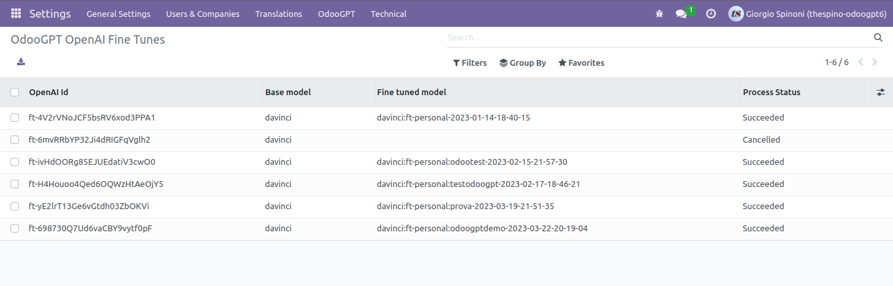
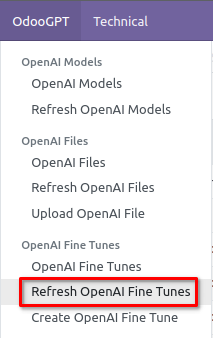
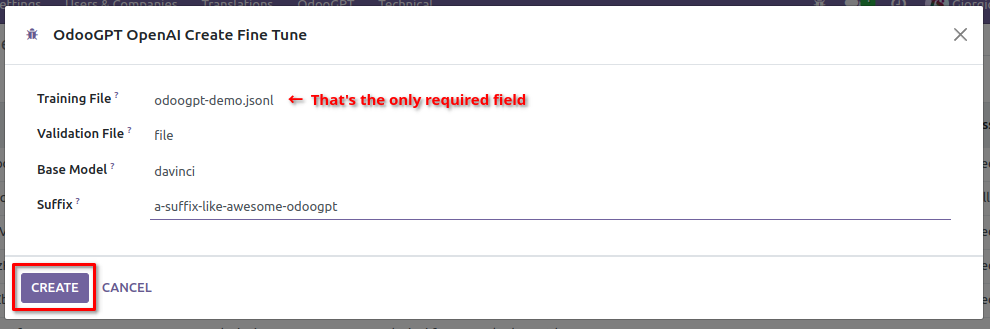

# OpenAI Fine-Tune

OdooGPT alows to retrieve, show and create Fine-Tunes with OpenAI api. 

Navigate to `Settings → OdooGPT (menu) → OpenAI Fine Tunes` to open the list of all Fine Tunes. 

To refresh the list with OpenAI api, you need to manually click 
`Settings → OdooGPT (menu) → Refresh OpenAI Fine Tunes`. 

!!! question "FAQ"
    > *The list is empty. What can I do?*

    Simply *Refresh Fine Tunes* as described above, then refresh the list by pressing **ENTER** on the 
    keyboard into the search field, to refresh the list. 

    That's needed because OdooGPT doesn't need to periodically ask OpenAI for new records and keep 
    them automatically aligned.

## Create a Fine-Tune (launch the fine tuning process)

Go to `Settings → OdooGPT (menu) → Create OpenAI Fine Tune`. It will show a popup wizard: 

- Select the **Training File** from the ones previously uploaded
- [OPTIONAL] Select a **Validation File** from the ones previously uploaded
- [OPTIONAL] Select a **Base Model** from the ones present into OpenAI (must have refreshed the 
    list before)
- [OPTIONAL] Write a **Suffix** that will be added to the trained model name
- Click "**Create**"
- The Fine Tunes list is now updated with the new fine tune in "*Pending*" or "*Running*" status.
- After a couple of minutes, **Refresh the Fine Tunes** and then reload the list. 
    At a certain point, you will see the completed Fine Tune in  "*Succeeded*" status.
- If you now **refresh the Models list**, you can find the trained model.

See [OpenAI docs](https://platform.openai.com/docs/api-reference/fine-tunes){:target="_blank"} for more info. 

### Use the trained model

- Go to `Settings → OdooGPT`. 
- Click on "**PICK MODEL...**" button 
- From the list, pick the model that you previously trained 
- Save settings 

## Cancel a Fine-Tune process

When a Fine Tune process is in "*Pending*" or "*Running*" status it is possible to cancel it. 

Go to `Settings → OdooGPT (menu) → OpenAI Fine Tunes`. It will show the list. 

- Open a record
- Click "**CANCEL FROM OPENAI**" button
- The fine-tune is cancelled from OpenAI

!!! danger "Danger zone"
    The standard Odoo "Delete" action will ONLY DELETE THE FINE-TUNE RECORD FROM ODOO DATABASE. When 
    you then refresh the list it's reloaded. Nothing happens in OpenAI. 

    Pressing "DELETE FROM OPENAI" will, instead, **PERMANENTLY CANCEL THE FINE-TUNE PROCESS FROM 
    OPENAI**. The operation cannot be undone.

