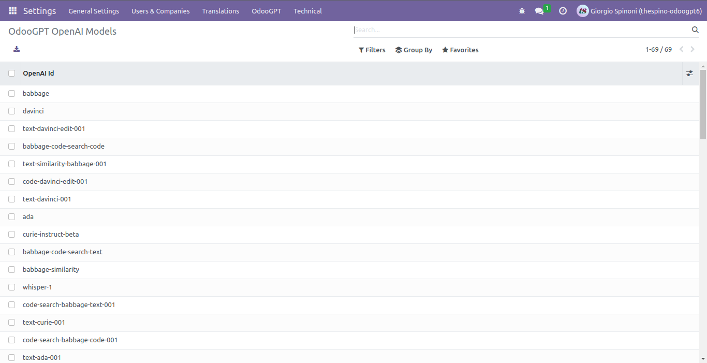
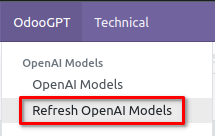

# OpenAI Models

OdooGPT alows to retrieve and show Models from OpenAI api. 

Navigate to `Settings → OdooGPT (menu) → OpenAI Models` to open the list of all available models. 

To refresh the list with OpenAI api, you need to manually click 
`Settings → OdooGPT (menu) → Refresh OpenAI Models`. 

!!! question "FAQ"
    > *The list is empty. What can I do?*

    Simply *Refresh Models* as described above, then refresh the list by pressing **ENTER** on the 
    keyboard into the search field, to refresh the list. 

    That's needed because OdooGPT doesn't need to periodically ask OpenAI for new records and keep 
    them automatically aligned.