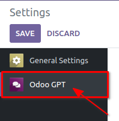
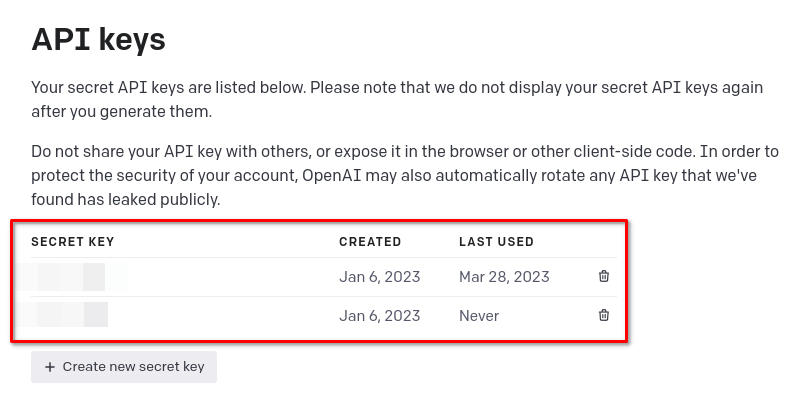
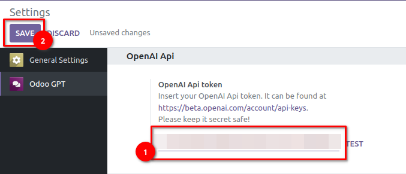
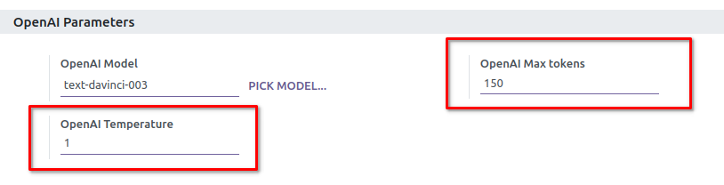
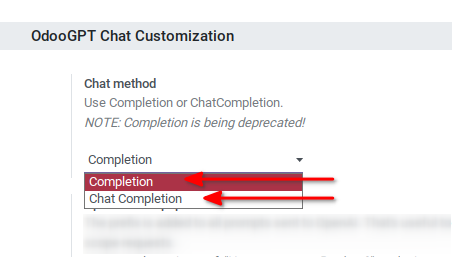
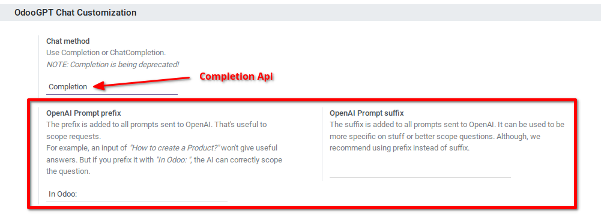
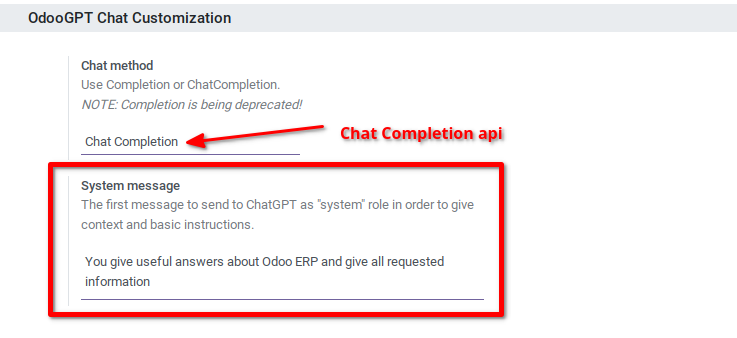

# OdooGPT & OpenAI Settings

All setting can be found at `Settings → Odoo GPT`. 

## OpenAI Api token

The OpenAI Api Token is required to allow Odoo to communicate with OpenAI apis. 

To get or generate your Api token, go to 
**[OpenAI Dashboard](https://platform.openai.com/account/api-keys){:target="_blank"}**: 

Paste the Token in OdooGPT setting in "**OpenAI Api token**" field: 

Save settings.

Then, click on `TEST` button. If you receive the notification 

> Test success! Everything properly set up! You're good to go! 

it means everything is correctly configured.

## OpenAI Model

You can customize the **Model** to use with OdooGPT. This allows also to use custom fine-tuned 
models. Simply write the model name in the field (if you exactly know it) or press `PICK MODEL` 
button to open the table with all the Models read from OpenAI api. 

Default is `text-davinci-003`, which is GPT-3 model.

## OpenAI Parameters

In this section, alongside with the OpenAI Model, you can also find some parameters that allows to 
customize the behaviour of OpenAI. Please refer to 
[OpenAI documentation](https://platform.openai.com/docs/api-reference/completions/create){:target="_blank"} to learn more. 
You can find default valuse in the picture below. 

!!! info
    Default value for Max Tokens is deliberately low, in order to prevent high usage when in test 
    phase. Recommended value for useful responses is at aound 400 ~ 500 tokens. Please keep that 
    in mind in order to prevent unwanted costs with OpenAI Api. 

## OdooGPT Chat Customization

The following settings allow you to customize the OdooGPT integration with OpenAI apis. 

You can choose which method to use with OpenAI: 

- **Completion api** - Always available, with any `openai` module version
- **ChatCompletion api** - :fontawesome-solid-circle-exclamation:{ .red-emoji } Available only with `openai>=0.27.0`

The mode can be selected into Chat Customization settings → field `Chat method`: 

### Completion api

The parameters under OdooGPT Chat Customization allow to add context to ALL Api requests, in order 
to let ChatGPT better understand what you're asking. 

For example, an input of "How to create a Product?" won't give useful answers. But if you prefix it 
with "In Odoo: ", the AI can correctly scope the question because you're adding context. 
Want to be more precise? You could even change it to "In Odoo 16: ". 

The same can be done with a suffix, if needed. 

### ChatCompletion api

With Chat Completion api, you must specify the general context of the messages that will be written
by users to OdooBot. This is useful to give instruction to OpenAI and get specific answers. A 
default value is already provided, look at the image: 

!!! danger "Important notice on Models compatible with ChatCompletion api"
    Depending on your OpenAI account or subscription, some Models might not work with ChatCompletion 
    api. If you get an error like *"Oops! Something went wrong! This is not a chat model and thus 
    not supported in the v1/chat/completions endpoint. Did you mean to use v1/completions?"*, please 
    try changing the model in settings or rollback to Completions api. 

    Generally, `gpt-3.5-turbo` works fine with ChatCompletion api, while `text-davinci-003` might 
    not be enabled. 

    **Example of generally INVALID configurations:**

    - Model `text-davinci-003` | Chat method: `Chat Completion`

    **Example of generally VALID configurations:**

    - Model `text-davinci-003` | Chat method: `Completion`
    - Model `gpt-3.5-turbo` | Chat method: `Completion`
    - Model `gpt-3.5-turbo` | Chat method: `Chat Completion`
