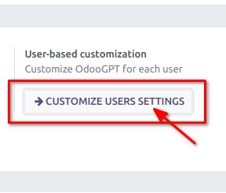
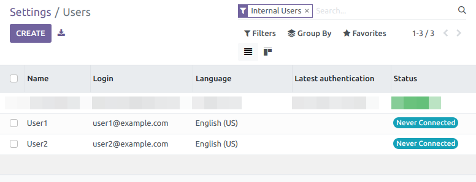
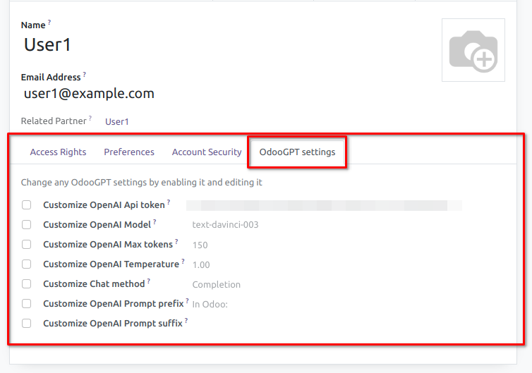
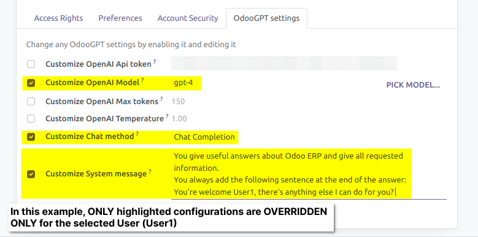
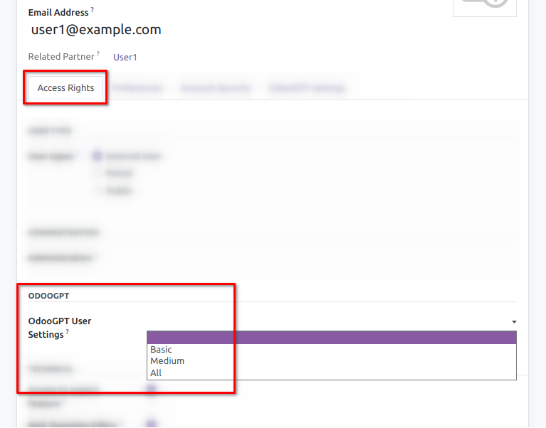
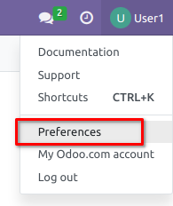
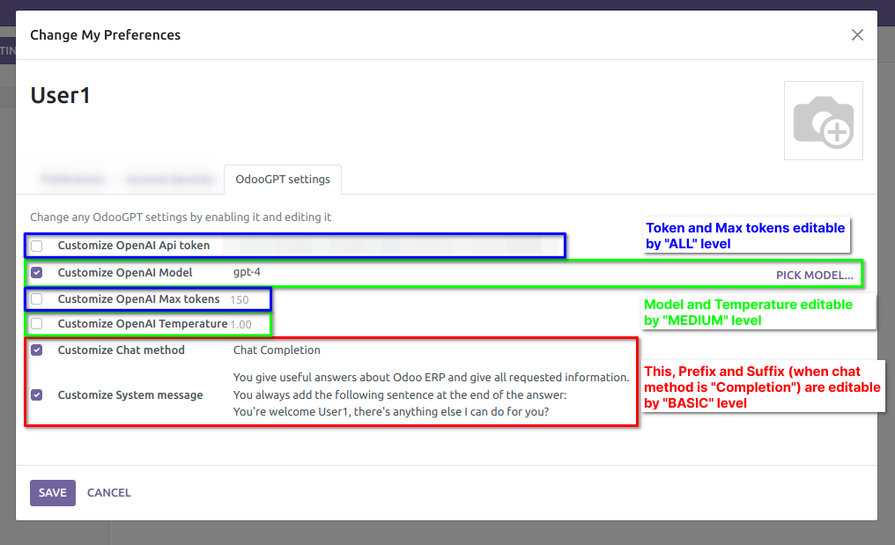
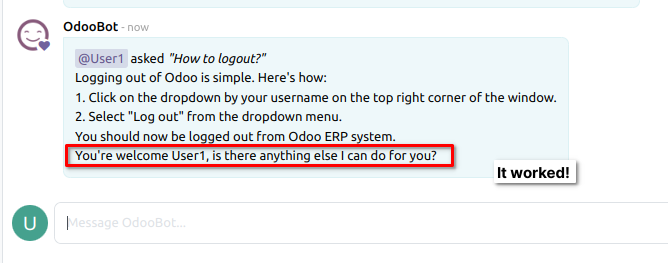

# User-level settings

Since version <kbd>v16.0.1.0.2</kbd> and <kbd>v15.0.1.0.2</kbd> it's possible to
customize OdooGPT settings on the user level. 

This allows, for example, to create an OdooBot friend that's different for each 
user, so that it has a different tone or answers different types of questions.

## Customize settings for Users

Go to `Settings → OdooGPT` and press <kbd>CUSTOMIZE USER SETTINGS</kbd> button 

This displays the Users list: 

Simply open an User and go into the `OdoOGPT settings` tab:

By default, the configuration is set at COMPANY level, in General Settings. 
Here you can simply **activate** a setting and customize it. 

This way you can **OVERRIDE** only the settings that are needed, the other ones 
will be taken from the COMPANY.

For example:

## Allow Users to self-edit OdooGPT settings

Based on permissions, you can allow Users to edit their own OdooGPT settings 
autonomously. 

First of all, go to `Settings → Users` and open an User. In the `Access Rights` 
tab, you can see the "**ODOOGPT**" section. 

Here are the 4 levels of permission explained:

- **[NONE SELECTED]**: Don't allow user to edit his personal OdooGPT settings
- **Basic**: Allow self editing some OdooGPT settings: Chat method, Prefix, Suffix or System Message
- **Medium**: Allow self editing some OdooGPT settings: All in Basic + Model, Temperature
- **All**: Allow self editing ALL OdooGPT settings: All in Medium + OpenAI Token, Max Tokens  
Warning! This will allow the user to see the OpenAI token associated with him

### How the User can customize his settings

The User that has been allowed, can edit his OdooGPT settings from the User Preferences 
panel, by clicking on `User Icon → Preferences → OdooGPT settings`

## Let's try it

When User1 asks something to OdooBot AI, it will give the following result (for this example): 

