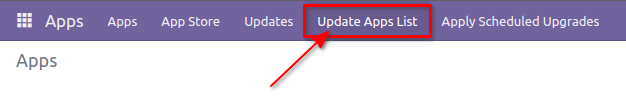
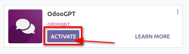
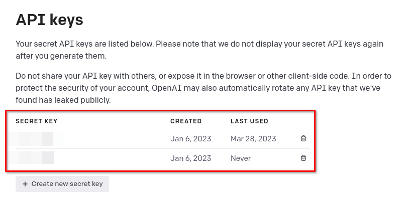
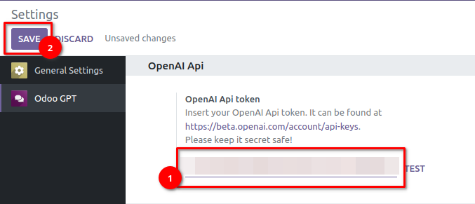

# Getting started


## Install openai Python library

*Also see [requirements](/docs/requirements/).*

First of all, run: 

``` sh
pip install openai
```

!!! note
    The module might work fine with any **openai** version, but it has been tested with **0.26.1**


## Load module

Load the folder module named `odoogpt` into the Odoo addons folder. This depends on your system 
configuration. Refer to [Odoo's documentation](https://www.odoo.com/documentation/16.0/developer/reference/cli.html#cmdoption-odoo-bin-addons-path){:target="_blank"}.

The, go into Odoo's backend with an administrative account. Navigate to `Apps` and click `Update Apps List`. 



??? tip
    If you cannot find action `Update Apps List`, please enable debug mode. See 
    [Odoo's documentation](https://www.odoo.com/documentation/16.0/applications/general/developer_mode.html?highlight=debug){:target="_blank"}


## Install module `odoogpt`

Remove  filter from filters and search `odoogpt` in the 
modules list and press `ACTIVATE` to install it. 



After installation, the page will refresh and you will be redirected to the Odoo homepage. 


## Configure OpenAI Api token

Navigate to `Settings → Odoo GPT`. 

Get or generate your Api token in [OpenAI Dashboard](https://platform.openai.com/account/api-keys){:target="_blank"}: 



Paste the Token in OdooGPT setting in "**OpenAI Api token**" field: 



Save settings.


## Test OpenAI Api token

Under `Settings → Odoo GPT` click on `TEST` next to the "**OpenAI Api token**" field. 
If you receive the notification 

> Test success! Everything properly set up! You're good to go! 

it means everything is correctly installed and ready to go!
