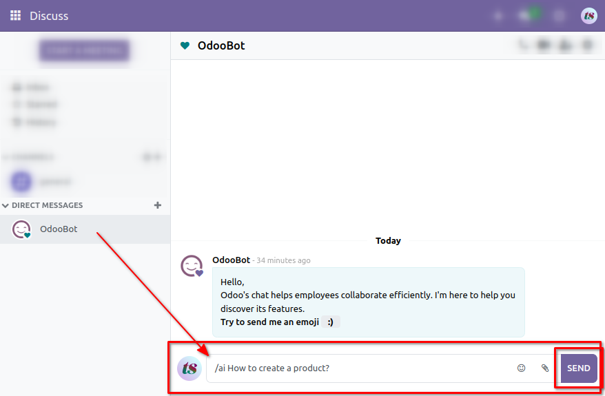
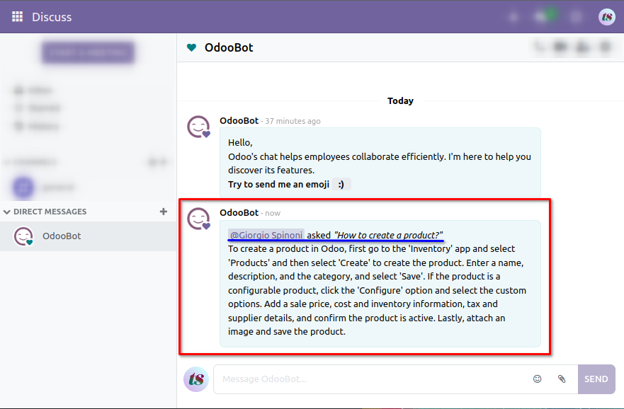

# Generic usage, for final users

Using OdooGPT is as simple as chatting with **OdooBot**, simply by prepending the command `/ai`.

OdooBot will respond with the **OpenAI ChatGPT** answer: 

You can ask anything!